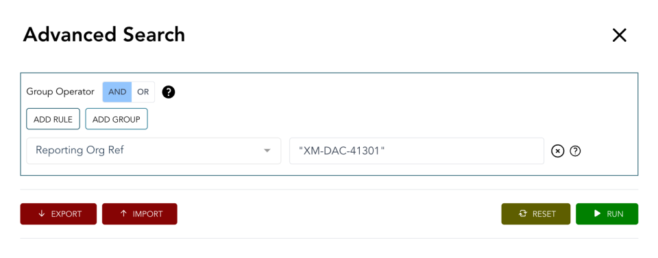
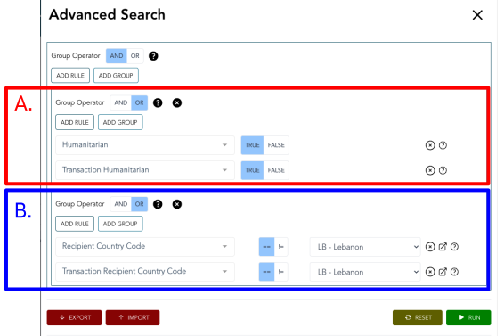
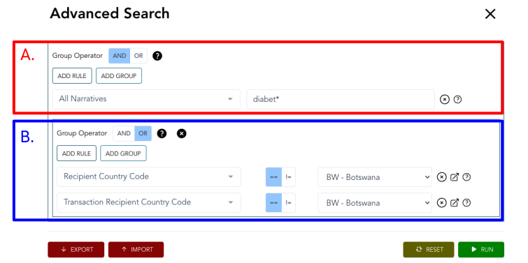

**************************************
Advanced Search: Example Queries
**************************************

1. :ref:`How do I find activities reported by the FAO? <adv_q1>`
2. :ref:`How do I find organisations involved in the humanitarian response in Lebanon? <adv_q2>`
3. :ref:`How do I find activites related to diabetes in Botswana? <adv_q3>`

| 

---------

| 

.. _adv_q1: 

1: How do I find activities reported by the FAO? 
-------------------------------------------------

A researcher is interested in agricultural funding in IATI data, spefically in activities reported by the Food and Agriculture Organization of the United Nations (FAO). 
They visit the `IATI Dashboard <https://dashboard.iatistandard.org/publishers/fao/>`_ and determine that the organisation identifer of FAO is XM-DAC-41301.

They therefore need to search for activities with the reporting organisation reference XM-DAC-41301, using the query **Reporting Org Ref == "XM-DAC-41301"** .
Note the quotation marks around the organisation identifer.

    Query 1:  Activities reported by the Food and Agriculture Organization of the United Nations

If the researcher wanted to expand this search to include other reporting organisations, such the United States Department of Agriculture (US-GOV-2), they can use a comma separated list of organisation identifiers.

For example, **Reporting Org Ref == "XM-DAC-41301", "US-GOV-2"**. You can :download:`download this query <files/adv_example_q1.json>` and test it out yourself by using the "Import Query" option in advanced search.

| 

---------

| 

.. _adv_q2: 

2: How do I find organisations involved in the humanitarian response in Lebanon? 
---------------------------------------------------------------------------------

A Local NGO is looking to coordinate with other organisations. They want to find a list of organisations who are supporting the humanitarian response in Lebanon.

First, they need to find IATI activities flagged as "Humanitarian" which list Lebanon as a recipient country. 
Both of these codes can be declared at activity or transaction level, so they need to create a grouped query.

* Group A. will look for Humanitarian flags, declared at activity **OR** transaction level. 
* Group B. will look for the recipient-country code LB for Lebanon, declared at activity **OR** transaction level. 

These groups are combined with the **AND** group operator, so the search returns results with the Humanitarian flag, **AND** Lebanon as a recipient. 

This creates the query **(Humanitarian == TRUE OR Transaction Humanitarian == TRUE) AND (Recipient Country Code == LB - Lebanon OR Transaction Recipient Country Code == LB - Lebanon)**. 
You can :download:`download this query <files/adv_example_q2.json>` and test it out yourself by using the "Import Query" option in advanced search.

    Query 2:  Humanitarian activities in Lebanon

Next, they need to find organisations involved in the activities. They download the output in the EXCEL format, at Activity level, and open the file in their preferred spreadsheet software.
All of the data about the IATI activities will be flattened into a single spreadsheet.

There are two places to look for organisations at the activity level:

1. Reporting Organisations
    A `reporting organisation <https://iatistandard.org/en/iati-standard/203/organisation-standard/iati-organisations/iati-organisation/reporting-org/>`_ is the organisation reporting an IATI activity. 
    Their names are in the "reporting_org_narrative" column. Filtering using a "remove duplicates" option will give a list of all reporting organisations.

2. Participating Organisations
    `Participating organisations <https://iatistandard.org/en/iati-standard/203/activity-standard/iati-activities/iati-activity/participating-org/>`_ are all organistions involved in an activity. 
    Their names are in the "participating_org_narrative" column. This will often contain multiple participating organistion names, separated by a pipe (|) character.
    Using a "split text to columns" option and specifying | as the separator will split the names into individual cells. These can then be combined into a single column and deduplicated as above.

Note - some duplication may remain as different names can be used for the same organisation. For example "World Health Organisation" and "WHO".

The NGO could also download the Transaction level file to investigate `receiver <https://iatistandard.org/en/iati-standard/203/activity-standard/iati-activities/iati-activity/transaction/receiver-org/>`_ and 
`provider <https://iatistandard.org/en/iati-standard/203/activity-standard/iati-activities/iati-activity/transaction/provider-org/>`_ organistions.

| 

---------

| 

.. _adv_q3: 

3: How do I find activites related to diabetes in Botswana? 
-----------------------------------------------------------

A researcher wants to find IATI activities with a focus on diabetes in Botswana.

They need to find IATI activities which mention diabetes in the title or description, and list Botswana as a recipient country. 
Recipient country codes can be declared at activity or transaction level, so they need to create a grouped query.

* Group A. will search for phrases related to diabetes in all narrative IATI elements, using the query **diabet\***. This uses the wildcard search operator **\***, meaning it will return results including the words diabetic and diabetes.
* Group B. will look for the recipient-country code BW for Botswana, declared at activity **OR** transaction level.

Group B is nested in Group A with the **AND** operator, so the search returns results which mention diabetes, **AND** have Botswana as a recipient.

This creates the query **All Narratives include diabet* AND (Recipient Country Code == BW - Botswana OR Transaction Recipient Country Code == BW - Botswana)**. 
You can :download:`download this query <files/adv_example_q3.json>` and test it out yourself by using the "Import Query" option in advanced search.

    Query 3: Activities related to diabetes in Botswana
