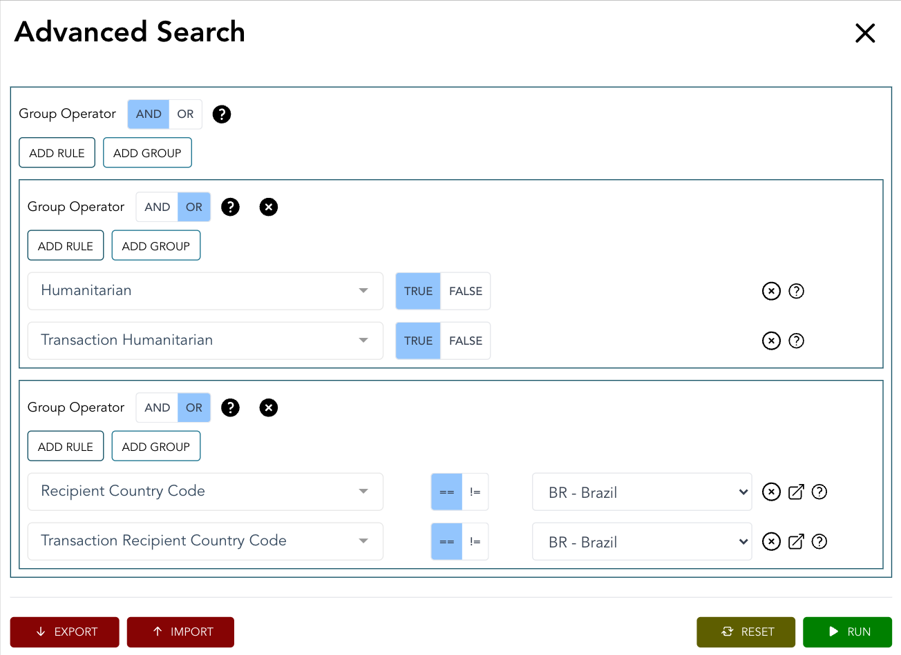

**************
Example Queries
**************

Query 1: Humanitarian activities in Brazil
-------------------

A data user is interested in IATI activities flagged as "Humanitarian", which list Brazil as a recipient country. 

Both of these codes can be declared at activity or transaction level, so they need to create a grouped query.

