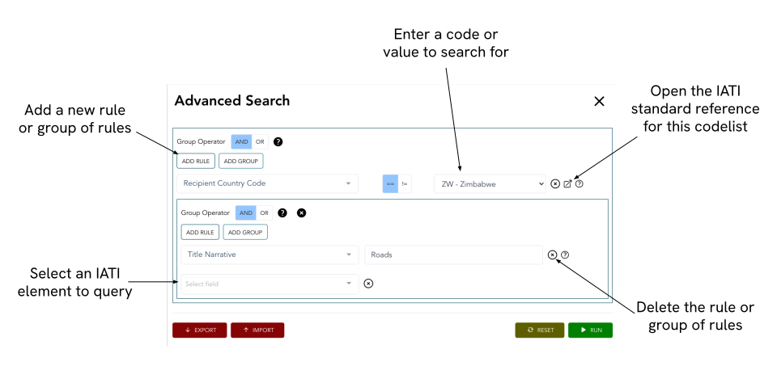

**************
Advanced Search
**************

To access the advanced search, click on the “Switch to Advanced Search” button on the `Datastore Search <https://datastore.iatistandard.org/>`_ homepage. This tool can be used to search all elements within IATI activity data.

For a summary of all elements in the standard, please see the `Activity Standard Summary Table <https://www.google.com/url?q=https://iatistandard.org/en/iati-standard/203/activity-standard/summary-table/&sa=D&source=docs&ust=1733222605142915&usg=AOvVaw1so5C1Bi3cyCOvJ2ziPKKk>`_.

.. important:: 
    We recommend reading the "Simple Search" section of this guide first.
    The simple search documentation includes important information on search operators and download formats. 

Building queries
-------------------

Click on the "Build Query" button in the advanced search menu to begin building your search query.

    The advanced search menu.

Next, click "Add Rule", and use the dropdown to select a field to search against. "Standard fields" map directly to elements of the IATI standard. You can then enter the value you want to search for.

For some fields (e.g. transaction dates) you can look for dates less than, equal to, or greater than the entered date using the **<**, **=**, and **>** operators. 
For other fields (e.g. recipient-country codes) use the **==** and **!=** operators to find codes equal to or not equal to the selected code.

For more complex queries, you can add more rules or groups of rules. See the :ref:`Example Queries` page for examples.

When your query is ready, click "Run" to excute it. You can also import and export queries to rerun at a later date.

.. tip:: 
    Quote marks must be used to search for organisation and iati-identifiers.
    For example, "XM-DAC-1234". Without quotes, **iati-identifer == XM-DAC-1234** would return matches to XM, DAC, and 1234.

Special fields
-------------------

In addition to standard fields, advanced search includes special fields. These are:

    **All Narratives:** All narrative elements within IATI activity data. This searches the same elements as in the Simple Search.
    
    **Geospatial Search:** Searches for results in a given geographical region using the `location <https://iatistandard.org/en/iati-standard/203/activity-standard/iati-activities/iati-activity/location/>`_ element. Click "Open map", and pan and zoom the map to define the search area. You can also hold the shift key and click and drag to select the search area.

Multi-valued fields
-------------------

If an element can occur multiple times within an IATI activity, it is stored as a multi-valued field. This is important to consider when using these elements in a query.
For example:

**Participating organisation type**

    The query **Participating Org Type == 11 - Local Government** returns all activities with at least one type 11 participating organisation. Other participating organistions referenced in the activity may not be of type 11.
    
    The query **Participating Org Type != 11 - Local Government** returns all activities with no type 11 participating organisations. 

**Transaction type**

    The query **Transaction Transaction Type Code == 1 - Incoming Funds** returns all activities with at least one incoming fund transaction. Other transaction types may be included in the activity.
    
    However, the transaction-level download can be used to only download incoming fund transactions from these results. See the simple search user guide for more information on download options.

Element Wise Searching
^^^^^^^^^^^^^^^^^^^^^^

It is not possible to query multi-valued fields in an element-wise fashion.

For example, consider the query: **Recipient Country Code == AF - Afghanistan AND Recipient Country Percentage == 30**. 

This returns all activities with a recipient country code of AF, and a recipient country with a percentage of 30%. 
However, this may not necessarily apply to the same recipient-country element. 

In some cases you may be able to work around this limitation by downloading results at the transaction or budget-level. This is because a single transaction can only have a single recipient-country, for example. 

.. toctree::
    :hidden:
    :titlesonly:
    :maxdepth: 3

    adv_example
